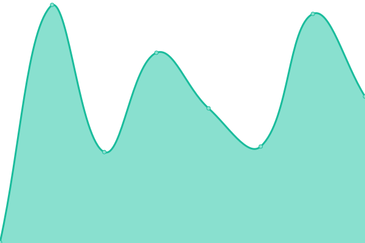

# [📈 Live Status](https://app3.aot-technologies.com): <!--live status--> **🟧 Partial outage**

This repository contains the open-source uptime monitor and status page for [Upptime](https://upptime.js.org), powered by [Upptime](https://github.com/upptime/upptime).

With [Upptime](https://upptime.js.org), you can get your own unlimited and free uptime monitor and status page, powered entirely by a GitHub repository. We use [Issues](https://github.com/upptime/upptime/issues) as incident reports, [Actions](https://github.com/AOT-Technologies/forms-flow-ai/actions) as uptime monitors, and [Pages](https://app3.aot-technologies.com) for the status page.

<!--start: status pages-->
<!-- This summary is generated by Upptime (https://github.com/upptime/upptime) -->
<!-- Do not edit this manually, your changes will be overwritten -->
<!-- prettier-ignore -->
| URL | Status | History | Response Time | Uptime |
| --- | ------ | ------- | ------------- | ------ |
|  [Sandbox Web](https://app3.aot-technologies.com/tenant/formsflowai) | 🟩 Up | [sandbox-web.yml](https://github.com/AOT-Technologies/forms-flow-upptime/commits/HEAD/history/sandbox-web.yml) | 

 1666ms
     
 | 

<a href="https://AOT-Technologies.github.io/forms-flow-upptime/history/sandbox-web">82.76%</a>
    

|  [Sandbox Keycloak](https://iam3.aot-technologies.com/auth/realms/multitenant-app3/.well-known/openid-configuration) | 🟩 Up | [sandbox-keycloak.yml](https://github.com/AOT-Technologies/forms-flow-upptime/commits/HEAD/history/sandbox-keycloak.yml) | 

 296ms
     
 | 

<a href="https://AOT-Technologies.github.io/forms-flow-upptime/history/sandbox-keycloak">99.27%</a>
    

|  [Sandbox API](https://app3.aot-technologies.com/api/) | 🟩 Up | [sandbox-api.yml](https://github.com/AOT-Technologies/forms-flow-upptime/commits/HEAD/history/sandbox-api.yml) | 

 62ms
     
 | 

<a href="https://AOT-Technologies.github.io/forms-flow-upptime/history/sandbox-api">99.09%</a>
    

|  [Sandbox Admin API](https://app3.aot-technologies.com/adminapi/api/v1/swagger.json) | 🟩 Up | [sandbox-admin-api.yml](https://github.com/AOT-Technologies/forms-flow-upptime/commits/HEAD/history/sandbox-admin-api.yml) | 

 56ms
     
 | 

<a href="https://AOT-Technologies.github.io/forms-flow-upptime/history/sandbox-admin-api">99.16%</a>
    

|  [Sandbox Forms](https://forms3.aot-technologies.com/) | 🟥 Down | [sandbox-forms.yml](https://github.com/AOT-Technologies/forms-flow-upptime/commits/HEAD/history/sandbox-forms.yml) | 

 436ms
     
 | 

<a href="https://AOT-Technologies.github.io/forms-flow-upptime/history/sandbox-forms">0.00%</a>
    

|  [Sandbox BPM](https://bpm3.aot-technologies.com/camunda/) | 🟥 Down | [sandbox-bpm.yml](https://github.com/AOT-Technologies/forms-flow-upptime/commits/HEAD/history/sandbox-bpm.yml) | 

 553ms
     
 | 

<a href="https://AOT-Technologies.github.io/forms-flow-upptime/history/sandbox-bpm">86.02%</a>
    

<!--end: status pages-->

## 📄 License

- Powered by: [Upptime](https://github.com/upptime/upptime)
- Code: [MIT](./LICENSE) © [Upptime](https://upptime.js.org)
- Data in the `./history` directory: [Open Database License](https://opendatacommons.org/licenses/odbl/1-0/)
